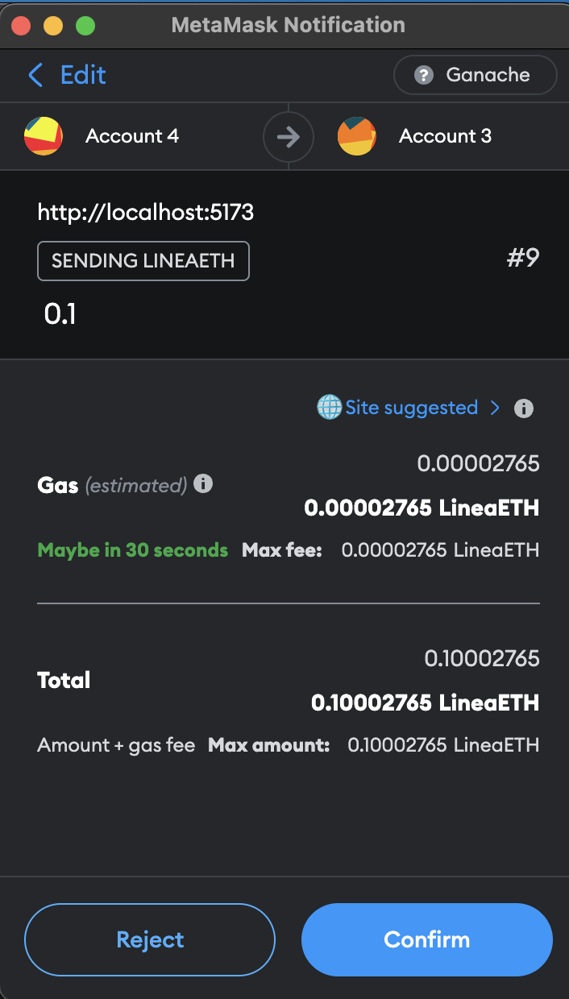

# ether-transaction

使用 Ethers.js 實作的簡單傳送 transaction 用 DApp。

## 連接 metamask

測試範例是連接到測試網路 Ganache，並匯入了兩個測試用帳號 `Account 3`, `Account 4` 作發送 transaction 測試使用。

進到頁面後若已經有登入 metaMask，會直接匯入使用中的帳號，並在介面上顯示 `address`，作為發送 transaction 帳號。

## 填寫 transaction 資訊

Nonce 自動帶入下一筆，To address 可填寫 transaction 目標的 address。（礦工費使用 EIP-1559）

點 Send 後，預設會發送 0.1 ETH 給目標 address。

