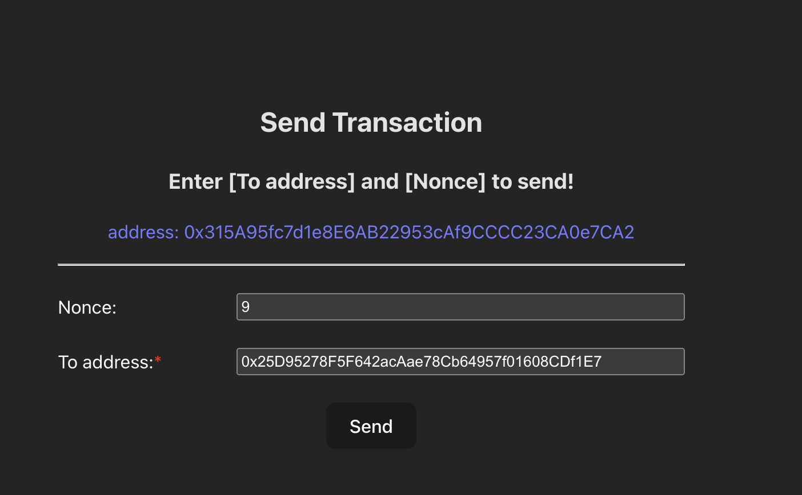
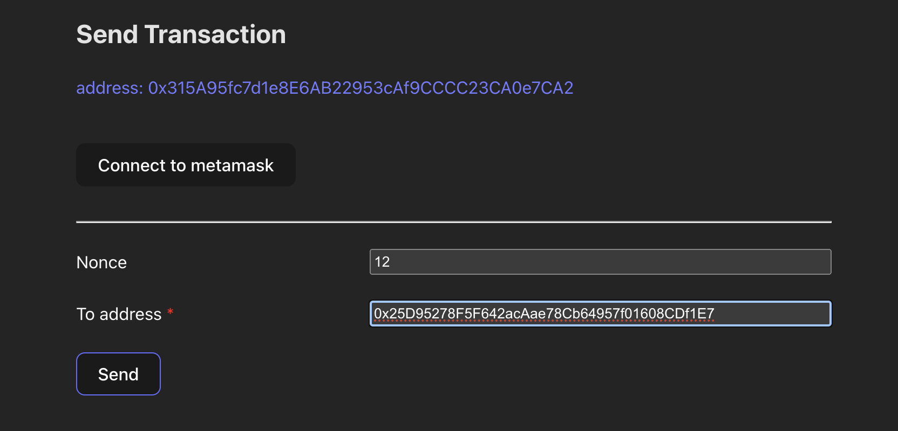
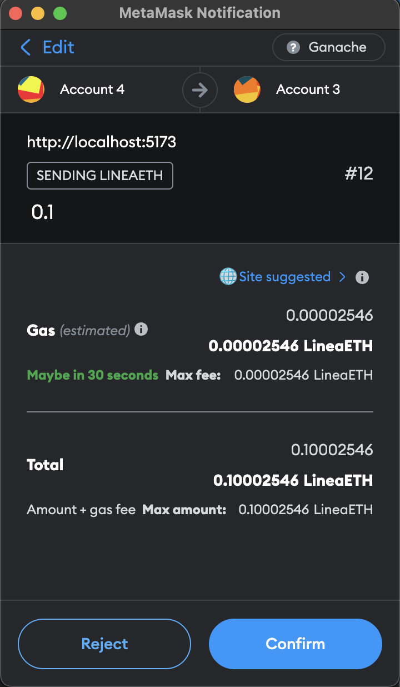
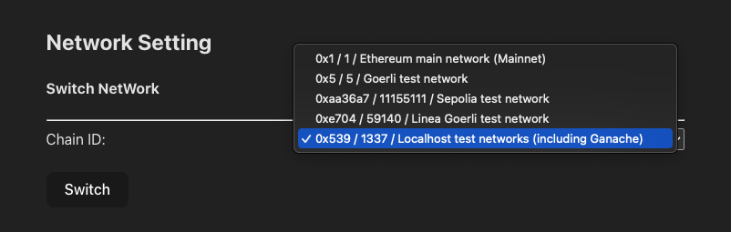
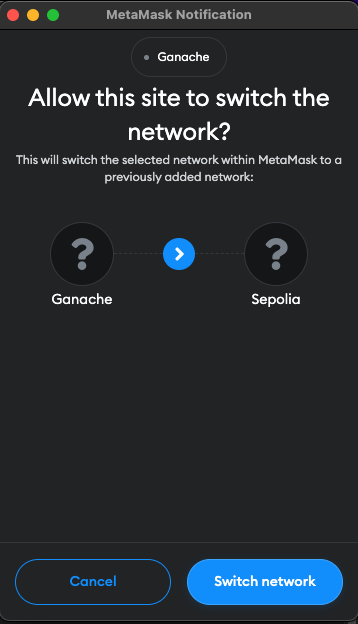
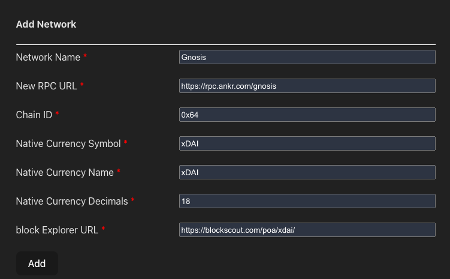
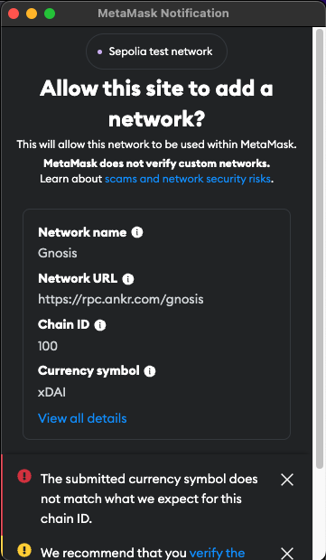

# ether-transaction

## 連接 metamask

進到頁面後若沒有 metamask 則需要先安裝，登入後可點選 `Connect to metamask` 來連接帳號。連接後在介面會上顯示 `address`，作為發送 transaction 帳號。

## 需求一：發送帶有指定 nonce 的 transaction

`Nonce` 自動帶入下一筆，`To address` 可填寫 transaction 目標的 `address`。（礦工費使用 EIP-1559）

點 Send 後，預設會發送 `0.1 ETH` 給目標 `address`。

## 需求二：切換節點網路（EIP-3326）

選項列出了 metamask 提供的預設網路，選擇後點 `Switch` 切換。

## 需求三：新增節點網路 (EIP-3085)

填寫新增網路的資訊後，點選 `Add` 新增。

